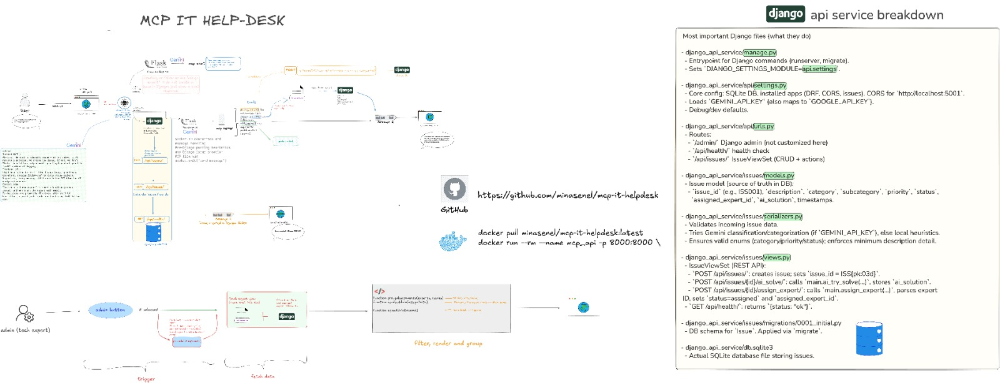

<div align="center">

# 🤖 MCP IT Help Desk

[](https://www.python.org/)
[](https://github.com/modelcontextprotocol)
[](https://github.com/evalstate/fast-agent)
[](LICENSE)

AI-powered IT support: understands issues (TR/EN), suggests fixes, and routes to the right experts. Experts are stored in Django DB.

</div>

<p align="center">
  
  <!-- Place the diagram image at images/api_service_breakdown.png -->
  <!-- The image illustrates overall system flow and Django API key files/routes -->
  <!-- If rendering on GitHub Pages, ensure the relative path is correct for the site base URL. -->
  
</p>

---

## ✨ Features
- **AI-Powered Classification (100% LLM)**: Turkish + English via Gemini; no heuristics
- **Auto-Solutions**: Common hardware/software/network fixes for non-critical cases
- **Smart Expert Assignment**: Availability + expertise + load consideration
- **Modern Web UI**: Real-time chat via Flask + Socket.IO + Tailwind
- **MCP Tools**: Add/process issues, AI try-solve, assign experts

## 🧭 Table of Contents
- 🔧 MCP Tools
- 🚀 Quick Start
- 🧱 Architecture
- 🗂️ File Structure
- 📖 Comprehensive Documentation
- ⚙️ Advanced Configuration
- 🧪 Usage Examples
- 🧠 Design Philosophy
- 🤝 Contributing & Support

## 🔧 MCP Tools

| Tool | Purpose | Inputs | Output |
|---|---|---|---|
| `add_issue` | Create a new ticket with normalized fields and timestamps | `employee_id, description, category, subcategory, priority` | `Issue created: ISSnnn` |
| `ai_try_solve` | Attempt auto-resolution for common issues (non-critical) | `description, category, subcategory, priority` | Solution text or suggestion to assign expert |
| `assign_expert` | Classify description and pick best available expert | `description` | `Assigned expert: T00x - Name (category/subcategory)` |
| `process_issues` | Batch normalize + auto-solve + assign/queue | none | Summary: closed_by_ai, assigned/queued, skipped |

### 👩‍💻 Expert Data Format (Django DB)

| Field | Type | Example | Notes |
|---|---|---|---|
| `id` | string (pk) | `T001` | Human-friendly ID |
| `name` | string | `Elif Hanım, Ağ Uzmanı` | Display name |
| `expertise` | JSON/list | `["network","vpn"]` | Tags matched by classifier |
| `contact` | string | `elif@example.com` | Optional |
| `availability` | boolean | `true` | Considered for assignment |
| `current_load` | integer | `0` | Incremented on assignment |

## 🚀 Quick Start

### Prerequisites
- Python 3.11+
- [uv](https://docs.astral.sh/uv/) (recommended)
- Gemini API key (required): set `GEMINI_API_KEY` or `GOOGLE_API_KEY`

### Install dependencies
```bash
uv sync
```

### Set up Django (migrations + import experts)
```bash
cd django_api_service
uv run python manage.py makemigrations
uv run python manage.py migrate
uv run python import_experts.py  # imports tech_experts.json into DB
```

### Run services
```bash
# MCP (via Fast Agent)
uv run fast-agent go --stdio "uv run python main.py"

# Django API (serves at http://localhost:8000; root "/" returns 404 by design)
uv run python django_api_service/manage.py runserver
# health check: http://localhost:8000/api/health/

# Web UI (Flask, serves at http://localhost:5001)
uv run python web_agent.py
# open http://localhost:5001
```

Notes:
- API routes live under `/api/` (e.g., `/api/health/`, `/api/issues/`). The root `/` returns 404 by design.
- The web frontend at `http://localhost:5001` calls the API at `http://localhost:8000` by default.

## 🧱 Architecture

```
Web UI (Flask/Socket.IO)         Django API (REST + ORM)         MCP Server (main.py)
         │                                │                               │
         │  create/assign issues (HTTP)   │                               │
         └──────────────► /api/issues/ ───┼──────────┐                    │
                                          │          │                    │
                                          ▼          │                    │
                                  SQLite (Issues, Experts)                │
                                                     ▲                    │
                                                     └── load experts ◄───┘
```

## 🗂️ File Structure

```
mcp-it-helpdesk/
├─ main.py                     # MCP server with tools
├─ problems.txt                # Legacy issue store (MCP-only)
├─ tech_experts.json           # Legacy sample; data is stored in Django DB
├─ web_agent.py                # Flask web chat
├─ templates/index.html        # Web UI
├─ django_api_service/
│  ├─ api/settings.py          # Django settings
│  ├─ manage.py
│  └─ issues/
│     ├─ models.py             # Issue, Expert models
│     ├─ serializers.py        # Validation + Gemini integration
│     ├─ views.py              # REST endpoints and actions
│     └─ migrations/           # Django migrations
└─ docs/images/                # (add your screenshots/diagrams here)
```

## 📖 Comprehensive Documentation

### Detailed Features and Benefits
- **Bilingual understanding (TR/EN)**: Reduces back-and-forth with users
- **AI-first classification**: Requires Gemini key; ensures consistent, accurate categorization
- **Human-in-the-loop**: Assign experts for high/critical cases or when AI can’t resolve

### Installation Guide (Step-by-Step)
1. Install dependencies with `uv sync`
2. Run Django migrations and import experts (see Quick Start)
3. Launch MCP, Django API, and the Web UI
4. Test with the usage examples below

### Practical Usage Examples
Inside Fast Agent:
```
/tools
/call main-add_issue {"employee_id":"E001","description":"VPN bağlantı sorunu","category":"network","subcategory":"vpn","priority":"medium"}
/call main-ai_try_solve {"description":"VPN bağlantı sorunu","category":"network","subcategory":"vpn","priority":"medium"}
/call main-process_issues
```

## ⚙️ Advanced Configuration
- **Gemini model**: Set `GEMINI_MODEL` env (default: `gemini-1.5-flash`)
- **API Keys (required)**: Provide `GEMINI_API_KEY` or `GOOGLE_API_KEY`. The app maps `GEMINI_API_KEY` to `GOOGLE_API_KEY` automatically.
- **CORS**: `settings.py` allows `http://localhost:5001` for the web UI; adjust for production
- **Secrets & DB**: `.gitignore` excludes local DBs and secrets; use `.env` files locally (don’t commit)

## 🧠 Design Philosophy
- **LLM-first**: Classification and validation are fully AI-driven
- **Single Source of Truth for Experts**: Experts live in Django DB (no runtime JSON fallback)

## 🧪 Testing Ideas
- Unit test serializers and classification (LLM prompts and outputs)
- Integration test Django actions that shell into MCP (`assign_expert`, `ai_solve`)
- E2E test via Web UI: create issue → assign expert → verify DB state

## 🐳 Docker

### Official Image

- Pull and run:
```bash
docker pull minasenel/mcp-it-helpdesk:latest
docker run --rm --name mcp_api -p 8000:8000 \
  -e GEMINI_API_KEY="<your_key>" \
  minasenel/mcp-it-helpdesk:latest
# open http://localhost:8000/api/health/
```

- If port 8000 is busy on your host, map another host port:
```bash
docker run --rm --name mcp_api -p 8001:8000 \
  -e GEMINI_API_KEY="<your_key>" \
  minasenel/mcp-it-helpdesk:latest
# then use http://localhost:8001
```

Notes:
- API routes live under `/api/`. The root `/` returns 404 by design.
- The frontend typically runs at `http://localhost:5001` and talks to the API at `http://localhost:8000`.

### Environment Variables
- `GEMINI_API_KEY` or `GOOGLE_API_KEY` (required)
- `SECRET_KEY` (recommended for production; generated if missing in dev)
- `DJANGO_ALLOWED_HOSTS` (set domains for production)

Examples:
```bash
docker run --rm -p 8000:8000 \
  -e GEMINI_API_KEY="<your_key>" \
  -e DJANGO_ALLOWED_HOSTS="localhost,127.0.0.1" \
  -e SECRET_KEY="change-me" \
  minasenel/mcp-it-helpdesk:latest
```

### Data Persistence
- The image uses SQLite by default inside the container. Data will be ephemeral unless you mount a volume:
```bash
# Persist the Django project folder (including db.sqlite3)
docker run --rm -p 8000:8000 \
  -e GEMINI_API_KEY="<your_key>" \
  -v "$PWD/django_data":/app/django_api_service \
  minasenel/mcp-it-helpdesk:latest
```

### Build locally (optional)
If you prefer to build from source:
```bash
# from repo root
docker build -t YOUR_USERNAME/mcp-it-helpdesk:latest .
docker run --rm -p 8000:8000 \
  -e GEMINI_API_KEY="<your_key>" \
  YOUR_USERNAME/mcp-it-helpdesk:latest
```

---

Licensed under **MIT**.
